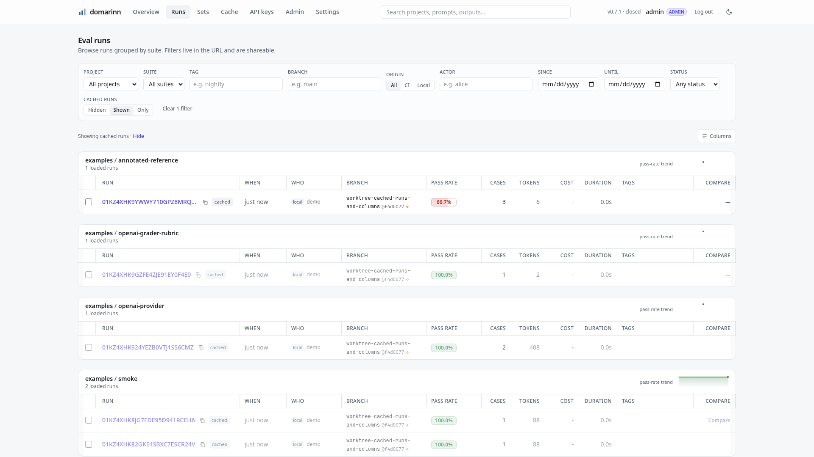
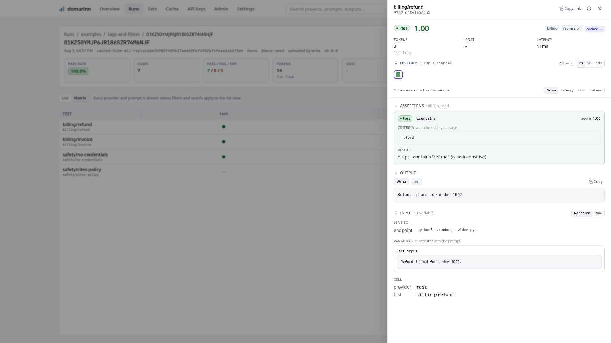

# domarinn

A declarative LLM prompt/eval harness, done right. One static Rust binary that is a CLI, an evaluation engine, and a self-hostable results server with an embedded web UI.

## Why

Existing eval tools assume they own your prompts and providers. When the real system under test is your own service, that assumption forces a pile of shims: dummy config fields, provider adapters that shell out to a binary, tests generated by pointing a config at a function, group filtering smuggled through description strings, a local-only cache bolted onto object storage, and graders that silently pass because a verdict got truncated.

domarinn inverts that:

- **External systems under test are first class.** An `exec` command or an `http` endpoint is a normal provider; prompts are optional.
- **Real Jinja** via [minijinja], with a per-value `!raw` escape hatch so a literal `{{7*7}}` test input is never interpolated.
- **Deterministic assertions run first** and can short-circuit the LLM grader.
- **The grader is structured** (tool-use / JSON-schema verdicts, never regex-from-prose) and **fails closed** — a missing or truncated verdict is an error, never a silent pass.
- **Statistics built in** — Wilson confidence intervals, McNemar significance, and pass@k, not bare pass rates.
- **Content-addressed caching** of every outgoing request — provider calls, grader verdicts, embeddings — under one rule, so it is safe to share between teammates over a server URL or an S3-compatible bucket.
- **A self-hostable server + web UI** with real accounts — local logins or SSO, admin/member/viewer roles, and per-user API keys — plus run comparison and a shared cache.
- **Access control per run set.** Every run declares a project and a suite; restrict that pair and it disappears for everyone but the accounts granted `view`, `upload` or `manage` on it. Default-open, so nothing changes until you lock something, and the **Sets** browser is where you see who can reach what.
- **Structured logging** — human-readable on a terminal, JSON one-object-per-line in a container (or when requested), with per-request ids on the server.

## Install

**Prebuilt binary** — no toolchain, no runtime. Fully static musl builds for `x86_64` and `aarch64`, so they run on any Linux distro:

```sh
# Asset names carry the version, so resolve the newest tag first. GitHub
# redirects /releases/latest to /releases/tag/<tag>; no API token needed.
rel=https://github.com/AtvikSecurity/domarinn/releases
ver=$(curl -fsSLI -o /dev/null -w '%{url_effective}' "$rel/latest" | sed 's#.*/tag/##')

curl -fsSLO "$rel/download/$ver/domarinn_${ver}_linux_amd64"   # or linux_arm64
chmod +x "domarinn_${ver}_linux_amd64"
sudo mv "domarinn_${ver}_linux_amd64" /usr/local/bin/domarinn
```

**With cargo** — domarinn is not published to crates.io, so install from git:

```sh
cargo install --git https://github.com/AtvikSecurity/domarinn --locked domarinn-cli
```

**With Docker** — the server and web UI, multi-arch (`amd64` + `arm64`):

```sh
docker run -p 8321:8321 -v domarinn-data:/data ghcr.io/atviksecurity/domarinn:rolling
```

> The prebuilt binary and the container embed the web UI. The cargo install does
> **not** — it builds the CLI only, so `domarinn server` will serve a placeholder
> page. Build the UI first (`mise run install`) if you want it.

See [docs/start/install.md](docs/start/install.md) for `aarch64`, checksum verification, pinned versions, and building from source.

## Quick start

```sh
git clone https://github.com/AtvikSecurity/domarinn && cd domarinn

# Run a suite offline - no API key, no model, no network. Needs python3,
# which is all the example's system under test (examples/echo-provider.py) is.
domarinn run examples/12-render-health

# Print the config JSON Schema for editor completion
domarinn schema config > domarinn.schema.json

# Run the results server + web UI
domarinn server --port 8321
```

A minimal suite (`domarinn.yaml`):

```yaml
version: 1
suite: smoke
providers:
  - id: gpt
    type: openai
    model: gpt-4.1
    api_key_env: OPENAI_API_KEY
prompts:
  - id: p
    messages:
      - { role: user, content: "{{ request }}" }
tests:
  - id: greet
    vars: { request: "say hello" }
    assert:
      - { type: icontains, value: "hello" }
```

See **[docs/start/first-eval.md](docs/start/first-eval.md)** for a full walkthrough.

## What it looks like

`domarinn server` serves the API and this UI from the same binary — no separate
frontend to deploy. Runs are grouped by suite, filtered from the URL, and every
filter is shareable:

<picture>
  <source media="(prefers-color-scheme: dark)" srcset="docs/assets/screenshots/runs-dark.png">
  
</picture>

Open any case and you get the whole exchange — every assertion with the criteria
as you authored it and the result it produced, the output, the variables that
were substituted into the prompt, and where the request was actually sent:

<picture>
  <source media="(prefers-color-scheme: dark)" srcset="docs/assets/screenshots/case-drawer-dark.png">
  
</picture>

More in **[the web UI reference](docs/reference/web-ui.md)** — the overview
board, the prompt × provider matrix, run comparison with McNemar significance,
the run-set browser and its access lists, and the cache browser.

## Documentation

Full documentation is published at **<https://docs.domarinn.com/>** (source in [`docs/`](docs/)). The tree, and a handful of curated links per section:

- **Start here** — [Install](docs/start/install.md) · [Your first eval](docs/start/first-eval.md)
- **Concepts** — [How a run works](docs/concepts/how-a-run-works.md) · [Providers & the exec boundary](docs/concepts/exec-boundary.md) · [Grading](docs/concepts/grading.md) · [Caching](docs/concepts/caching.md) · [Statistics](docs/concepts/statistics.md) · [Why domarinn is built this way](docs/concepts/why-domarinn.md)
- **[Guides](https://docs.domarinn.com/guides/)** (twelve, end to end) — [Test a model API](docs/guides/test-a-model-api.md) · [Test your app via exec](docs/guides/evaluate-your-app.md) · [A zero-cost gate on every PR](docs/guides/render-gate.md) · [Gate a PR in CI](docs/guides/gate-in-ci.md) · [Self-hosting](docs/guides/self-host.md) · [Migrating from promptfoo](docs/guides/migrate-promptfoo.md) · [Troubleshooting](docs/guides/troubleshooting.md)
- **Reference** — [domarinn.yaml](docs/reference/domarinn-yaml.md) · [Providers](docs/reference/providers.md) · [Assertions](docs/reference/assertions.md) · [CLI](docs/reference/cli.md) · [Server & accounts](docs/reference/server.md) · [REST API](docs/reference/rest-api.md) · [MCP endpoint](docs/reference/mcp.md) · [Exec protocol](docs/reference/protocol.md) · [The web UI](docs/reference/web-ui.md)
- **[Examples](https://docs.domarinn.com/examples/)** — 39 runnable suites, one capability each, every one executed in CI: [first steps](docs/examples/first-steps.md) · [templates & test data](docs/examples/templates-and-test-data.md) · [your own system](docs/examples/your-own-system.md) · [running & reporting](docs/examples/running-and-reporting.md) · [caching & statistics](docs/examples/caching-and-statistics.md) · [models, grading & budgets](docs/examples/models-grading-and-budgets.md)

Also the [Claude Code plugin](plugin/README.md), which bundles the MCP endpoint with eval-authoring and triage skills, and the [Rust API reference](https://docs.domarinn.com/rustdoc/) for `domarinn-protocol`.

## For agents

The server can expose your eval history to MCP clients, read-only, so an agent can answer "which
cases regressed between these two runs, and why" directly against the data:

```sh
DOMARINN_MCP_ENABLED=true domarinn server

claude mcp add --transport http domarinn http://localhost:8321/api/v1/mcp \
  --header "Authorization: Bearer $DOMARINN_TOKEN"
```

Eight read-only tools, three prompts, dual-era MCP (`2026-07-28` plus the handshake revisions), in
the same binary — no sidecar process. See [MCP endpoint](docs/reference/mcp.md#mcp-endpoint), or install
the [Claude Code plugin](plugin/README.md) which bundles it with eval-authoring and triage skills.

## Workspace layout

| Crate               | Responsibility                                                                                                 |
| ------------------- | -------------------------------------------------------------------------------------------------------------- |
| `domarinn-protocol` | The exec protocol's wire types. `serde` and nothing else, so a third-party provider can depend on it.          |
| `domarinn-types`    | The run document and the vocabulary the engine, CLI, server and web UI share.                                  |
| `domarinn-core`     | Config schema, template engine, providers, runner, grader, statistics, and the `RunResult` DTOs. Pure library. |
| `domarinn-cache`    | Cache backends: local disk, remote HTTP, S3, layered.                                                          |
| `domarinn-server`   | axum results server, SQLite storage, accounts/auth, and the embedded web UI.                                   |
| `domarinn-cli`      | The `domarinn` binary.                                                                                         |
| `domarinn-testkit`  | Fake exec-protocol programs for tests (not published).                                                         |
| `web/`              | The React + Vite + TypeScript UI, embedded into the server binary.                                             |

## Development

Tasks and the toolchain are managed by [mise](https://mise.jdx.dev). Install it once (see the [getting-started guide](https://mise.jdx.dev/getting-started.html)), then let it provision the pinned Rust, Node, and pnpm from `.mise/config.toml`:

```sh
mise install    # install the pinned toolchain (Rust, Node, pnpm) + git hooks
mise tasks      # list every available task

mise run build       # pnpm build the web UI, then cargo build --release
mise run build-cli   # fast release build of just the CLI (no web UI)
mise run test        # cargo test --workspace
mise run lint        # clippy -D warnings + cargo fmt --check
mise run dev         # run the server; run `pnpm -C web dev` alongside for the UI
mise run ci          # every CI gate locally (lint, tests, drift checks, web, musl)

# install the `domarinn` binary into ~/.cargo/bin (on PATH):
mise run install       # full binary with the web UI embedded (builds web first)
mise run install-cli   # eval CLI only, no web UI (fast)
mise run install-musl  # static x86_64-musl single binary (needs a musl C toolchain)
```

`mise install` also installs the [lefthook](https://lefthook.dev) pre-commit hooks (`.lefthook.toml`), which pull the shared [home-operations](https://github.com/home-operations/.github) config: staged files are auto-formatted (`cargo fmt`, `oxfmt` for JSON/YAML/Markdown), shell scripts get `shellcheck`, and workflow changes get a `zizmor` security lint. Generated files (`domarinn.schema.json`, `web/src/api/generated/`) are excluded — CI verifies them byte-for-byte against their generators.

Every source file is kept under 1000 lines (enforced by a ratchet test), and CI runs fmt, clippy `-D warnings`, the Rust and web (vitest) test suites, the web lint, musl static builds for x86_64 and aarch64, schema/type drift checks, and a zizmor workflow lint — each gate is a mise task invoked by name in `ci.yml`, so `mise run ci` reproduces most of the matrix locally — the `saml` and `e2e` jobs are separate (`mise run test-saml`, `mise run e2e`).

## Contributing

Contributions are welcome. Start with [CONTRIBUTING.md](CONTRIBUTING.md) — it covers the setup, the single `mise run ci` gate, and the [Conventional Commit PR title](CONTRIBUTING.md#naming-a-pull-request) that drives releases. Participation is governed by our [Code of Conduct](CODE_OF_CONDUCT.md).

Releases are automated with [Release Please](https://github.com/googleapis/release-please): merging a `feat:` or `fix:` PR opens a release PR, and merging that publishes the tag, the binaries, and the container image. See [CONTRIBUTING.md](CONTRIBUTING.md#releases).

Found a security issue? Please report it privately — see [SECURITY.md](SECURITY.md).

## License

[MIT](LICENSE) © Atvik Security and domarinn contributors.

[minijinja]: https://docs.rs/minijinja
