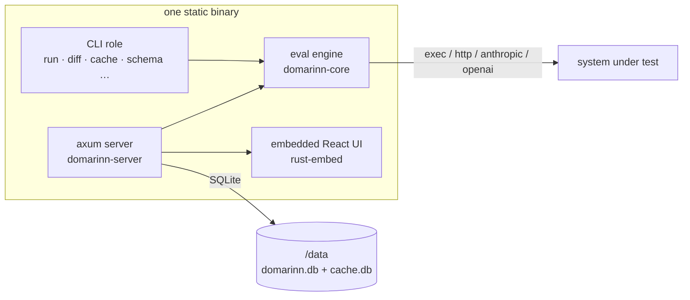

# Architecture — one binary

domarinn ships as a single static executable that plays three roles depending on the subcommand: a CLI, an evaluation engine, and a self-hostable results server with an embedded web UI. There is no sidecar process, no separate daemon to keep in sync, and no version skew between "the CLI" and "the server" — they are the same build.

## One binary, three roles

`domarinn run` drives the CLI role straight through the eval engine and exits. `domarinn server` starts the axum server, which holds its own copy of the engine (for on-demand re-grading and comparisons) and serves the web UI's static assets out of the binary itself — the prebuilt binary and the container image embed `web/dist` via `rust-embed`, so there is nothing to deploy alongside it. A `cargo install` of `domarinn-cli` builds the CLI and engine only; `domarinn server` still runs, but serves a placeholder page instead of the real UI, because the assets were never embedded. `mise run install-cli` builds that fast path deliberately; `mise run install` (or `mise run build`) builds the web UI first so the full binary embeds it.

"Nothing is a sidecar" extends to the container itself: the distroless image's `HEALTHCHECK` runs `domarinn healthcheck`, the same binary probing its own `/api/v1/health` — there is no curl, no shell, and no second process doing the checking. See [Self-hosting](../guides/self-host.md) for what "one binary" means operationally: single writer, one replica, `Recreate` not `RollingUpdate`.

## The crates

Adapted from the workspace table in [README.md](https://github.com/AtvikSecurity/domarinn#workspace-layout):

| Crate | Responsibility | Published? |
|---|---|---|
| `domarinn-protocol` | The exec protocol's wire types. `serde` and nothing else, so a third-party provider can depend on it without inheriting the rest of the workspace. | **Yes** — the one crate meant for outside consumers (via git tag; not on crates.io). |
| `domarinn-types` | The run document and the vocabulary the engine, CLI, server and web UI share. | No — workspace-internal. |
| `domarinn-core` | Config schema, template engine, providers, runner, grader, statistics, and the `RunResult` DTOs. Pure library. | No |
| `domarinn-cache` | Cache backends: local disk, remote HTTP, S3, layered. | No |
| `domarinn-server` | axum results server, SQLite storage, accounts/auth, and the embedded web UI. | No |
| `domarinn-cli` | The `domarinn` binary. | No |
| `domarinn-logging` | Shared `tracing-subscriber` setup for the binaries (not in README's table, but a real workspace member). | No |
| `domarinn-testkit` | Fake exec-protocol programs for tests. | No — explicitly not published. |
| `web/` | The React + Vite + TypeScript UI, embedded into the server binary. | No — ships only inside the binary/image. |

That "published?" column is not a style choice. `domarinn-protocol` depends on `serde` and `serde_json` and nothing else — a test in the crate pins that — precisely so a provider written against it does not inherit `domarinn-types`' `schemars`/`ts-rs`/`chrono` dependency bill just to serialize four structs. It is also the crate the shipped rustdoc lands on by default (the `LANDING_CRATE` in `scripts/build-docs.sh`), for the same reason: it is the one crate someone outside this repository actually writes code against.

## Where data lives

Two on-disk locations matter, and they resolve *differently* — worth knowing before either surprises you:

- **`.domarinn/cache`** resolves beside the *suite*: `--cache-dir` wins, then `DOMARINN_CACHE_DIR`, then `<suite dir>/.domarinn/cache`. Running the same suite from any working directory hits the same cache. A cwd-relative `.domarinn/cache` from before this was true — if one still exists — is layered underneath as a read-only legacy tier rather than dropped. See [Where the cache lives](caching.md#where-the-cache-lives).
- **`.domarinn/runs`** resolves relative to the *current working directory* the CLI was invoked from — not the suite path. This is exactly what makes `--against latest` unreliable in CI: a fresh checkout has no `.domarinn/runs` at whatever directory the job happens to run from, so `latest` finds nothing and warns rather than failing. `--against server:baseline` is the one that survives a clean clone; see [Baselines on the server](statistics.md#baselines-on-the-server).

The server's data directory (`DOMARINN_DATA_DIR`, default `/data`) holds exactly two SQLite files: `domarinn.db` (run history, users, sessions, API keys, baselines — the backup target) and `cache.db` (the shared, disposable content-addressed cache). See [Self-hosting](../guides/self-host.md#what-the-server-is-and-is-not).

## The boundaries that matter

Two contracts hold the pieces above together, and both are versioned deliberately rather than implicitly.

**The exec protocol is THE extension point.** Anything domarinn cannot talk to natively — your own service, a model behind a gateway, a custom grader — plugs in as a process speaking a small JSON-over-stdio protocol, in any language. That protocol's envelope carries its own version (`protocol: 1` today), and the envelope is deliberately *inside* the request the cache key hashes: a real `exec` child may answer a v2 request differently than a v1 one, so bumping `PROTOCOL_VERSION` is a **cache flag day** — every `exec` entry, in every store, re-keys at once, on purpose. See [Providers & the exec boundary](exec-boundary.md) and [protocol.md § Versioning](../reference/protocol.md#versioning).

**The result schema version is the CLI↔server↔UI contract.** `RunResult` — what a run produces — carries `RESULT_SCHEMA_VERSION` (`2` as of this writing). The server's `/api/v1/meta` reports both that number and the window it will still ingest (`result_schema_version - 1 ..= result_schema_version`), so a CLI one release behind can still upload, and a body outside the window is rejected with `422` rather than silently misread. The web UI's TypeScript types are generated from the same Rust structs the CLI serializes, so the three components can be built and released independently without inventing a second source of truth for what a run document looks like.

## See also

- [Providers & the exec boundary](exec-boundary.md) — what crosses the process boundary, and why it is a process rather than a plugin.
- [How a run works](how-a-run-works.md) — the mechanics of one run, cell by cell.
- [Self-hosting](../guides/self-host.md) — running the server role in production.
- [The one-rule cache](caching.md) — the key rule everything above defers to.
