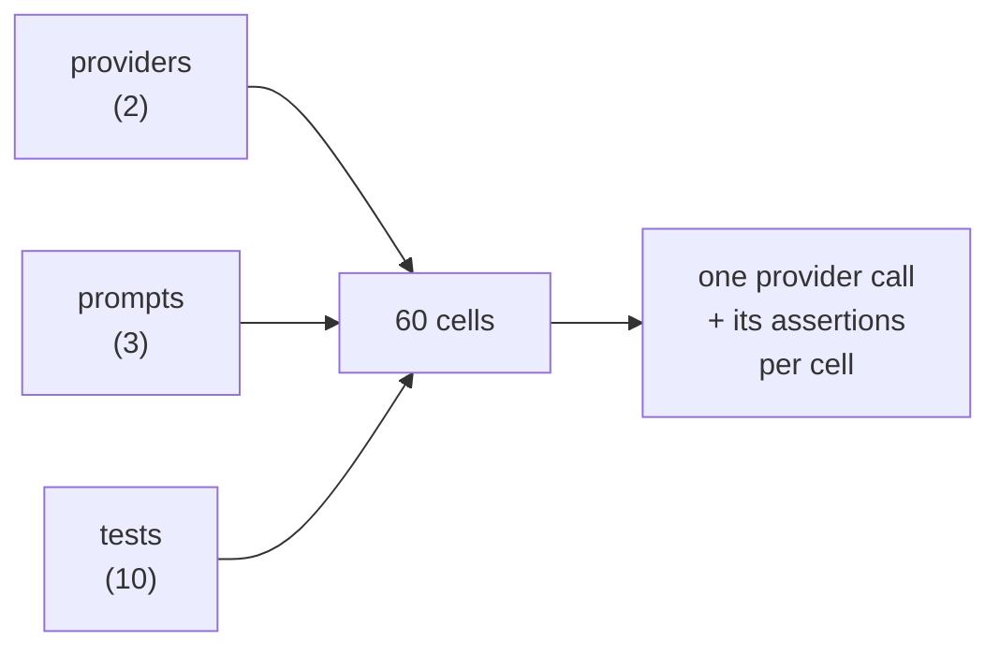

# How a run works

Four ideas explain most of domarinn's behaviour. Everything else in these docs is detail hanging off them.

## A run is a grid

domarinn takes the **providers** (the systems under test), the **prompts** (optional — a provider may build its own input), and the **tests** (the cases), and evaluates one **cell** per combination.

Each cell makes **one** provider call and grades the answer against that case's assertions. Two providers and three prompts over ten cases is sixty calls, not ten — which is the point when you are comparing two phrasings or two models, and a surprise when you are not. `domarinn list tests` tells you what a suite resolves to before you spend anything.

A cell ends in one of four states:

| Status | Meaning |
| ------ | ------- |
| `pass` | The case's assertions were satisfied. |
| `fail` | An assertion was not satisfied. The system under test got worse. |
| `error` | The call never produced a gradeable answer. **You learned nothing.** |
| `skip` | Filtered out, not applicable to this cell, or skipped by `skip_on_empty_reason`. |

`fail` and `error` are kept apart end to end — separate tally, separate exit code — because they demand different responses. A gate that conflates "the model got worse" with "the harness broke" trains people to ignore it.

## Cheap assertions run first, and can stop the expensive ones

Within a case, evaluation happens in two passes.

1. **Deterministic.** Every local assertion runs, in config order. No network, no cost.
2. **Graded.** The runner sums the weight of the not-yet-run graded assertions (`exec`, `llm-rubric`, `similar`) and asks whether they could *still* change the outcome. If they cannot, they are recorded as `skipped` and never executed.

"Could still change the outcome" is decided precisely:

- **No threshold** (all-must-pass): the graded assertions matter only while every deterministic one has passed. The moment one fails, the case is already decided, and the judge is skipped.
- **With a threshold**: compute the best and worst achievable weighted means, treating the remaining assertions as all-`1.0` and all-`0.0`. The judge runs only if the threshold sits between them.

This is why you write `contains` above `llm-rubric` and not the other way round. See [example 18](../examples.md#example-18--a-failing-gate), which keeps a skipped grader in it deliberately.

## The grader is structured, and fails closed

An `llm-rubric` verdict is not prose that domarinn parses. It is a forced tool call (or a JSON-schema response) carrying `pass`, `score` and `reasoning`.

A missing, malformed or **truncated** verdict is an `error`. Never a silent pass, and never a `0`.

The distinction matters because the alternative is worse than it looks: a judge that ran out of tokens mid-sentence would score `0` under any regex-the-prose scheme, which reads as a genuine failure of the system under test and sends you to debug a prompt that was fine.

## The cache key is the request, not the machine

Every outgoing call — a provider, the judge, an embedding, an `exec` grader — is keyed by one rule: **hash what is sent.** The SHA-256 of the redacted request, plus the trial index, plus any `cache_salt` in scope. Nothing about your machine, your binary, or your credentials.

That is what makes a cache shareable, and it has a consequence you must know about: **a rebuild of your own binary does not invalidate anything**, because the key hashes what the program *sends*, not its bytes. [`cache_salt`](../examples.md#example-22--cache-salts) is the lever for that, and it exists at two granularities for good reason.

The full rule, every knob, and what a 0.5 upgrade does to a warm store are in [caching.md](../caching.md#the-rule).

## See also

- [Why domarinn is built this way](why-domarinn.md) — the decisions behind the above.
- [Examples](../examples.md) — every idea here, as a suite you can run.
- [Caching](../caching.md) — backends, salts, and what busts what.
- [Assertions](../assertions.md) — scoring, weights, and the full type list.
